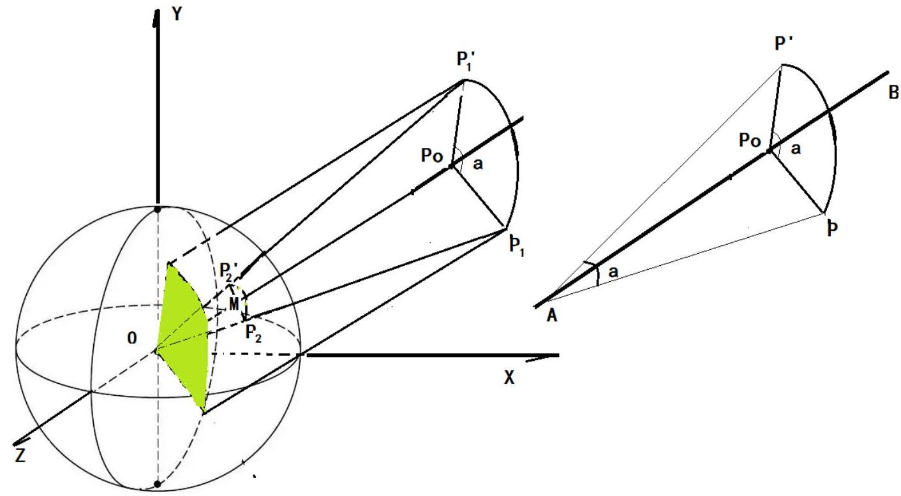
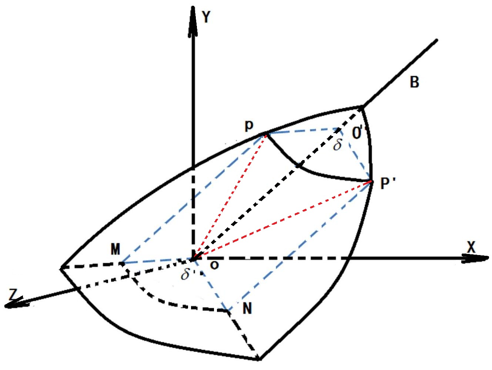

<h1 align="Center">四元数表示空间坐标旋转的公式证明</h1>

<h2 align="Center">刘文庆 整理</h1>

### 一，矢量计算

1. #### 矢量的表示：

$$
\begin{aligned}
& O \vec{A}=\left(\begin{array}{ll}
X_{A}, & Y_{A}, \\
Z_{A}
\end{array}\right)-\left(X_{o}, Y_{o}, Z_{o}\right)=\left(X_{A}, \quad \mathrm{Y}_{A}, \mathrm{Z}_{A}\right) \\
& O \vec{A}+O \vec{B}=\left(X_{A}+X_{B}, Y_{A}+Y_{B}, Z_{A}+Z_{B}\right)=O \vec{P}
\end{aligned}
$$

2. #### 矢量的分解：

   

3. #### 单位矢量及空间坐标表示：

   $r=(x, y, z)$ 满足 $\sqrt{x^{2}+y^{2}+z^{2}}=1$ 则 $r$ 为单位矢量，利用单位适量可以表示与单位适量方向重合的空间点的坐标：

$$
\begin{aligned}
& |\mathrm{P}|=\sqrt{\mathrm{X}_{\mathrm{p}}^{2}+\mathrm{Y}_{\mathrm{p}}^{2}+\mathrm{Z}_{\mathrm{p}}^{2}} \\
& \text { 则: } P=|P| * r=(|P| x,|P| y,|P| z)
\end{aligned}
$$

4. #### 向量的点积（内积）：

$$
A * B=\left(X_{A} X_{B}+Y_{A} Y_{B}+Z_{A} Z_{B}\right)=|A| B \mid \cos (\alpha)
$$

​        两向量的点积等于一标量，切等于两矢量的模相乘再乘以矢量夹角的余弦函数。通常通过计算矢量的点积判断两矢量是否垂直。

5. #### 向量的叉积（外积）：

   $$\vec{A} \times \vec{B}=\left|\begin{array}{c}X_{A} \\ Y_{A} \\ Z_{A}\end{array}\right| \times\left|\begin{array}{c}X_{B} \\ Y_{B} \\ Z_{B}\end{array}\right|=\left|\begin{array}{c}Y_{A} Z_{B}-Z_{A} Y_{B} \\ \mathrm{Z}_{\mathrm{A}} X_{B}-X_{A} Z_{B} \\ X_{A} Y_{B}-Y_{A} X_{B}\end{array}\right|=|A||B| \sin (\alpha) \bullet \vec{n}$$
   
   
   
   其中 $\vec{n}$ 为垂直与 $A, ~ B$ 构成的平面的单位矢量，满足右手定则。

## 二. 空间中点 $P(P x, P y, P z)$ 绕任意直线 $A B$ 旋转的计算：

1. #### $A B$ 为一直线，我么可以通过直线的参数方程表示直线上的任意一点的坐标：

$$
\left\{\begin{array}{l}
x=A_{x}+a t \\
y=A_{y}+b t \\
z=A_{z}+c t
\end{array}\right.
$$

$$
\begin{array}{r}
a=\frac{\mathrm{B}_{\mathrm{x}}-\mathrm{A}_{\mathrm{x}}}{\sqrt{\left(\mathrm{~B}_{\mathrm{x}}-A_{x}\right)^{2}+\left(\mathrm{B}_{\mathrm{y}}-A_{y}\right)^{2}+\left(\mathrm{B}_{\mathrm{z}}-A_{z}\right)^{2}}}=\cos (\alpha) \\
\text { 其中 } b=\frac{\mathrm{B}_{\mathrm{y}}-\mathrm{A}_{\mathrm{y}}}{\sqrt{\left(\mathrm{~B}_{\mathrm{x}}-A_{x}\right)^{2}+\left(\mathrm{B}_{\mathrm{y}}-A_{y}\right)^{2}+\left(\mathrm{B}_{\mathrm{z}}-A_{\mathrm{z}}\right)^{2}}}=\cos (\beta) \\
c=\frac{\mathrm{B}_{\mathrm{z}}-\mathrm{A}_{\mathrm{z}}}{\sqrt{\left(\mathrm{~B}_{\mathrm{x}}-A_{x}\right)^{2}+\left(\mathrm{B}_{\mathrm{y}}-A_{y}\right)^{2}+\left(\mathrm{B}_{\mathrm{z}}-A_{z}\right)^{2}}}=\cos (\gamma)
\end{array}
$$

​        如果 $A B$ 直线不过远点，我们可以通过坐标平移将 $A$ 点平移到原点，进行变换后再平移到 A 点：

$$
\begin{aligned}
& \vec{A}=\vec{A}-\vec{A} \\
& \vec{B}=\vec{B}-\vec{A} \\
& \vec{P}=\vec{P}-\vec{A}
\end{aligned}
$$

$$
\vec{B}=\vec{B}-\vec{A} \quad \text { 旋转变换 }
$$

$$
\vec{P}^{\prime \prime}=\vec{P}^{\prime}+A
$$

​        这样我们就将问题简化为 $P$ 绕通过原点 0 的直线 $O B$ 轴旋转 $a$ 角，计算 $P^{\prime}$ 点的坐标。

2. #### 单元球，问题的进一步简化：

$$
O \vec{P}=\frac{P_{x}}{\sqrt{P_{x}^{2}+P_{y}^{2}+P_{z}^{2}}} t, \frac{P z}{\sqrt{P_{x}^{2}+P_{y}^{2}+P_{z}^{2}}} t, \frac{P_{z}}{\sqrt{P_{x}^{2}+P_{y}^{2}+P_{z}^{2}}} t
$$

$O \vec{B}=\frac{B_{x}}{\sqrt{B_{x}^{2}+B_{y}^{2}+B_{z}^{2}}} t, \frac{B z}{\sqrt{B_{x}^{2}+B_{y}^{2}+B_{z}^{2}}} t, \frac{B_{z}}{\sqrt{B_{x}^{2}+B_{y}^{2}+B_{z}^{2}}} t$

​        t 代表单位长度的倍数，如果我们设 $\mathrm{t}=1$ ．就定义了单位球；其方程表示形式为 $P^{\prime}$ $(x, y, z):$
$$
x^{2}+y^{2}+z^{2}=1
$$

$$
\begin{aligned}
x & =\cos (\alpha) \\
y & =\cos (\beta) \\
\text { 其中 } z & =\cos (\gamma) \quad \alpha_{\text {为 }} P^{\prime} \text { 点在 } \mathrm{xy} \text { 平面中的投影与 } \mathrm{x} \text { 轴的夹角, } \beta_{\text {为 }} P^{\prime} \text { 点在 }
\end{aligned}
$$

yz 平面中的投影与 y 轴夹角，$\gamma_{\text {为 }} P^{\prime}$ 点在 zx 平面中的投影与 z 轴的夹角（我们均遵从右手定则）。

通过定义单位球，空间中的任意 P 的坐标，均可以通过 OP 与单位球的交点 $P^{\prime}$ 的坐标进行表示：

$$
\begin{aligned}
& x=\cos (\alpha)^{*} t \\
& y=\cos (\beta)^{*} t \\
& z=\cos (\gamma) * t
\end{aligned} \quad \text { 其中 } \mathrm{t}=|\mathrm{OP}|=\sqrt{\mathrm{P}_{\mathrm{x}}^{2}+\mathrm{P}_{\mathrm{y}}^{2}+\mathrm{P}_{\mathrm{z}}^{2}}
$$

通过坐标平移和单位球简化， P 点绕任意直线 AB 旋转 $\delta$ ，就可以单位球面上 $\mathrm{P}_{2}$ 绕 OB 直线旋转 $\delta$ 到 $\mathrm{P}_{2}$ 点的球面坐标问题。

## 三. 利用矢量计算，完成坐标旋转的变换过程：

如图，单位园球 $x^{2}+y^{2}+z^{2}=1$ 上的点 $\mathrm{P}(\mathrm{a}, \mathrm{b}, \mathrm{c})$ 绕 OB 旋转 $\delta$ 角到 $P^{\prime}\left(x^{\prime}, y^{\prime}, z^{\prime}\right)$ ，显然 p和 $P^{\prime}$ 均在单位园球上。

通过 p 点作 $O B$ 的垂线交点为 $\mathrm{O}^{\prime}$ ，显然 $\mathrm{P}^{\prime} \mathrm{O}^{\prime}$ 垂直与 $O B$ 直线。在平面 $O O^{\prime} P$ 内通过 P

点作平行于 $O O^{\prime}$ 的平行线，平面 $O O^{\prime} P$ 内通过 $O$ 点做平行于 $O^{\prime} P$ 的平行线，两平行线相较于 $M$ 点，显然 $O O^{\prime} P M$ 为长方形，我们建立空间平面的点法式方程 $A x+B Y+C x+D=0$ ，和直线的点法式参数方程：$\left\{\begin{array}{l}x=A_{x}+a t \\ y=A_{y}+b t \\ z=A_{z}+c t,\end{array}\right.$ ，通过直线 $O B$ 和平面 $O^{\prime} P P^{\prime}$ 很容易求得 $O^{\prime}$ 点的坐标。

同理，我们可以求得 $M$ 坐标。
根据矢量加法规则：
$$
\begin{aligned}
& \mathrm{O} \overrightarrow{\mathrm{P}}=\mathrm{O} \overrightarrow{\mathrm{O}}^{\prime}+\mathrm{O}^{\prime} \overrightarrow{\mathrm{P}}=\mathrm{O} \overrightarrow{\mathrm{O}}^{\prime}+\mathrm{OM} \overrightarrow{\mathrm{M}} \\
& \mathrm{O}^{\prime}=\mathrm{O} \overrightarrow{\mathrm{O}}^{\prime}+O^{\prime} \vec{P}^{\prime}=\mathrm{O} \overrightarrow{\mathrm{O}}^{\prime}+\mathrm{O} \overrightarrow{\mathrm{~N}}
\end{aligned}
$$

通过公式我们可以看出要求 $P^{\prime}$ 点坐标，只要球的 $N$ 点坐标，而在 $O M N$ 平面内 $N$ 点坐标可以看作 OM 绕 O 点旋转$\delta $角的结果${\text { }}|\mathrm{OM}|=|O N|$ 。

我们再看 $O O^{\prime}$ 与 $O M$ 和 $O N$ 的关系，$O O^{\prime}$ 与 $O M$ 正交，即相互垂直，$O O^{\prime}$ 与 $O N$ 正交，即相互垂直。这样通过矢量公式，它们存在一下计算关系：

​       OB的单位矢量$\mathrm{u}(\mathrm{a}, \mathrm{b}, \mathrm{c})=\left(\cos \left(\alpha\right), \cos \left( \beta\right), \cos \left(\gamma\right)\right)$
$$
\begin{aligned}
& O \vec{O}^{\prime}=(\mathrm{OP} \bullet u) \cdot u \\
& \text { 这样 } O \vec{M}=O \vec{P}-O \vec{O}^{\prime}=O \vec{P}-(O \vec{P} \bullet u) \cdot u
\end{aligned}
$$

如图我们单独将 OMN 该平面提取出来：
   

在平面内，通过 O 点做垂直于 $O M$ 的直线 $O W$ ，显然 OMW 构成正交直角坐标系：
         $O B$ 的单位矢量 $u$ 与平面 $O M N$ 锤子，$O W$ 同时垂直于矢量 $u$ 和 $O M$ ，根据矢量正交理论：
$$
O \vec{W}=u \otimes O \vec{M} \quad \text { 且 }|O M|=|O W|=|O N| \quad u \text { 为单位矢量。 }
$$

这样就存在如下的矢量计算关系：
$O \vec{N}=\vec{v}_{v}^{\prime}+\overrightarrow{\mathrm{v}}_{w}^{\prime}=|O N| \cos (\theta)+|O N| \sin (\theta)=\cos (\theta) O \vec{M}+\sin (\theta) O \vec{W}=\cos (\theta) O \vec{M}+\sin (\theta)(u \otimes O \vec{M})$
这样就可以球的 OP＇矢量：
根据 $u$ 与 OM 垂直，根据叉积性质，数量三角形面积等于：
$$
u \otimes O \vec{P}=u \otimes O \vec{M}
$$

$$
\begin{aligned}
O \vec{P}^{\prime} & =O \vec{O}^{\prime}+\mathrm{ON}=(O \vec{P} \bullet u) \cdot u+\cos (\theta) O \vec{M}+\sin (\theta)(u \otimes O \vec{M}) \\
& =(O \vec{P} \bullet u) \cdot u+\cos (\theta)(O \vec{P}-(O \vec{P} \bullet u) \cdot u)+\sin (\theta)(u \otimes O \vec{P}) \\
& =(1-\cos (\theta)) \cdot(O \vec{P} \bullet u) \cdot u+\cos (\theta) O \vec{P}+\sin (\theta)(u \otimes O \vec{P}) \\
& =(O \vec{P} \bullet u) u+\cos (\theta)(O \vec{P}-(O \vec{P} \bullet u) u)+\sin (\theta)(u \otimes O \vec{P})
\end{aligned}
$$

这就是著名的罗德里格斯公式．
有了罗德里格斯公式，我们就可以用数学方法推导出四元数表示的旋转变换了．

## 四. 四元数表示旋转的公式推导与证明

​         罗德里格斯公式中的存在两个向量 $O P$ 和单位项链 $u$（过 $O$ 点，与 $A B$ 重合的旋转轴）。他们都是三维向量。如果我们引入四为向量 ax＋by＋cz＋d 表示三维空间点时，

## 这时我们开始在此处键入公式。定义四元数及其运算性质：

$\mathrm{Q}=\mathrm{w}+\mathrm{ai}+\mathrm{bj}+\mathrm{ck}$ 其中 w 为实数， $\mathrm{ai}, \mathrm{bj}, \mathrm{ck}$ 为虚数，$i^{2}=j^{2}=k^{2}=i j k=-1$四元数的计算：

$$
\begin{aligned}
& P=\left(p_{w}, \vec{P}\right) \\
& Q=\left(Q_{w}, \vec{Q}\right) \\
& P+Q=\left(P_{w}+Q_{w},(\vec{P}+\vec{Q})\right) \\
& P-Q=\left(P_{w}-Q_{w},(\vec{P}-\vec{Q})\right) \\
& P * Q=\left(p_{w}, \vec{P}\right) \bullet\left(Q_{w}, \vec{Q}\right)=\left(P_{w} Q_{w}-\vec{P} \bullet \vec{Q}, P_{w} \vec{Q}+Q_{w} \vec{P}+\vec{P} \otimes \vec{Q}\right) \\
& Q * P=\left(Q_{w}, \vec{Q}\right) \bullet\left(p_{w}, \vec{P}\right)=\left(Q_{w} P_{w}-\vec{Q} \bullet \vec{P}, P_{w} \vec{Q}+Q_{w} \vec{P}-\vec{P} \otimes \vec{Q}\right)
\end{aligned}
$$

注意：
令：$P=(a+(b, c, d)) \quad Q=(e+(f, g, h))$
则

$$
\begin{aligned}
& P=a+b i+c j+d k \\
& Q=e+f i+g j+h k
\end{aligned}
$$

这样我们可以这样表示：

$$
\mathrm{P} * \mathrm{Q}=[\mathrm{ae}-v u, e v+a u+v \times u]\left(v=\left[\begin{array}{l}
b \\
c \\
d
\end{array}\right], u=\left[\begin{array}{l}
f \\
g \\
h
\end{array}\right]\right)
$$

为了推导公式方便，我们首先简化向量的表示：
设：

$$
\begin{aligned}
& O \vec{P}=\vec{v} \\
& O \vec{P}^{\prime}=\overrightarrow{\mathrm{v}}^{\prime} \\
& \mathrm{OM}=\overrightarrow{\mathrm{v}}_{\perp} \\
& \mathrm{O} \overrightarrow{\mathrm{~N}}=\overrightarrow{\mathrm{v}}_{\perp}^{\prime} \\
& \overrightarrow{\mathrm{O}}^{\prime}=\overrightarrow{\mathrm{v}}_{\mathrm{II}}
\end{aligned}
$$

分别推广到四元数表示：

$$
\begin{aligned}
& \mathrm{V}=(0, \vec{v}) \\
& \mathrm{v}^{\prime}=\left(0, \vec{v}^{\prime}\right) \\
& \mathrm{v}_{\perp}=\left(0, \overrightarrow{\mathrm{v}}_{\perp}\right) \\
& \mathrm{v}_{\perp}^{\prime}=\left(0, \overrightarrow{\mathrm{v}}_{\perp}^{\prime}\right) \\
& u=(0, \vec{u})
\end{aligned}
$$

根据前面推导：

$$
O \vec{N}=\vec{v}_{v}^{\prime}+\vec{v}_{w}^{\prime}=|O N| \cos (\theta)+|O N| \sin (\theta)=\cos (\theta) O \vec{M}+\sin (\theta) O \vec{W}=\cos (\theta) O \vec{M}+\sin (\theta)(u \otimes O \vec{M})
$$

写成

$$
v_{\perp}^{\prime}=\cos (\theta) v_{\perp}+\sin (\theta)\left(u \otimes v_{\perp}\right)=\cos (\theta) v_{\perp}+\sin (\theta) w \quad w=\left(0,\left(u \otimes v_{\perp}\right)\right)
$$

而

$$
u v_{\perp}=\left(-\vec{u} \bullet \vec{v}_{\perp}, \vec{u} \times \vec{v}_{\perp}\right)
$$

$\vec{u}$ 与 $\vec{v}_{\perp}$ 相互垂直，点积等于 $0, u v_{\perp}=\left(0, \vec{u} \times \vec{v}_{\perp}\right)=w$
所以：

$$
v_{\perp}^{\prime}=\cos (\theta) v_{\perp}+\sin (\theta) u v_{\perp}=(\cos (\theta)+\sin (\theta) u) v_{\perp}
$$

定义四元数：
$q=\cos (\theta)+u \sin (\theta)=\cos (\theta)+i \sin (\theta)+j \sin (\theta)+k \sin (\theta)$
得：$v_{\perp}^{\prime}=q v_{\perp}$
这样就可以计算出：

$$
\mathrm{v}^{\prime}=v_{\perp}^{\prime}+\mathrm{v}_{\mathrm{U}}=\mathrm{q} v_{\perp}+\mathrm{v}_{\mathrm{L}}
$$

我们构造另外一个四元数：
$\mathrm{p}=\left(\cos \left(\frac{\theta}{2}\right), u \sin \left(\frac{\theta}{2}\right)\right)$
$p^{2}=p p=e^{\frac{\theta}{2} u} * e^{\frac{\theta}{2} u}=e^{\theta u}=q$ 这里用到欧拉公式，证明见第五部分。
这样：

$$
\mathrm{v}^{\prime}=\mathrm{pp} v_{\perp}+\mathrm{v}_{\mathrm{U}}=\mathrm{pp} v_{\perp}+p p^{-1} \mathrm{v}_{\mathrm{U}}=\mathrm{pp} v_{\perp}+p p^{*} \mathrm{v}_{\mathrm{U}} \quad \quad \quad \text { 和 } \mathrm{q} \text { 均为单位四元数 }|\mathrm{p}|=1
$$

我们根据四元数相乘公式

$$
\mathrm{P} * \mathrm{Q}=[\mathrm{ae}-v u, e v+a u+v \times u]\left(v=\left[\begin{array}{l}
b \\
c \\
d
\end{array}\right], u=\left[\begin{array}{l}
f \\
g \\
h
\end{array}\right]\right)
$$

对于 $\mathrm{v}_{\mathrm{U}}=\left[0, \vec{v}_{\mathrm{U}}\right]$ 和 $p=[\alpha, \beta u]$ ，由于 $\mathrm{v}_{\mathrm{U}}$ 与 p 平行，可以计算出：
$p v_{\amalg}=v_{\amalg} p$
对于 $v_{\perp}=\left[0, \vec{v}_{\perp}\right]$ 和 $\mathrm{p}=[\alpha, \beta u]$ ，由于两矢量垂直，可以计算出：
$p v_{\perp}=v_{\perp} q^{*}$
所以：

$$
v_{\prime}=p v_{\perp} p^{*}+p v_{\amalg} p^{*}=p\left(v_{\perp+} v_{\amalg}\right) p^{*}=p v p^{*}=p v p^{-1} \text { 四元数表示旋转 }
$$

其中：

$$
\begin{aligned}
& p=\cos (\theta / 2)+i \sin (\theta / 2)+j \sin (\theta / 2)+k \sin (\theta / 2) \\
& p^{*}=\cos (\theta / 2)-i \sin (\theta / 2)-j \sin (\theta / 2)-k \sin (\theta / 2)
\end{aligned}
$$

到此我们就完整推倒除了四元数表示空间坐标旋转的理论公式，你看明白了么？

## 五. 欧拉公式证明过程

在公式推倒过程中，用到欧拉公式 $e^{i \theta}=\cos (\theta)+i \sin (\theta)$
我们首先对欧拉公式进行证明：欧拉公式 $e^{i \pi}+1=0$ 被誉为数学中最完美的公式。
我们分别将 $\sin x, ~ \cos x, ~ e^{x}$ 用泰勒公式展开：

$$
\begin{aligned}
& \sin x=\sum_{n=0}^{\infty}(-1)^{n} \frac{x^{2 n+1}}{(2 n+1)!}=x-\frac{x^{3}}{3!}+\frac{x^{5}}{5!}-\frac{x^{7}}{7!}+\ldots \ldots+(-1)^{n} \frac{x^{2 n+1}}{(2 n+1)!} \\
& \cos x=\sum_{n=0}^{\infty}(-1)^{n} \frac{x^{2 n}}{(2 n)!}=1-\frac{x^{2}}{2!}+\frac{x^{4}}{4!}-\frac{x^{6}}{6!}+\ldots \ldots+(-1)^{n} \frac{x^{2 n}}{(2 n)!} \\
& e^{x}=\sum_{n=0}^{\infty} \frac{x^{n}}{n!}=1+x+\frac{x^{2}}{2!}+\frac{x^{3}}{3!}+\frac{x^{4}}{4!}+\frac{x^{5}}{5!}+\frac{x^{6}}{6!}+\frac{x^{7}}{7!}+\ldots \ldots+\frac{x^{n}}{n!}
\end{aligned}
$$

我们知道虚数 $\mathbf{i}$ 有以下性质：
$i^{0}=1$
$i^{1}=i$
$i^{2}=-1$
$i^{3}=-i$
$i^{4}=1$
则：

$$
\begin{aligned}
& \sin x=\sum_{n=0}^{\infty}(-1)^{n} \frac{x^{2 n+1}}{(2 n+1)!}=x+\frac{x^{3} i^{2}}{3!}+\frac{x^{5} i^{4}}{5!}+\frac{x^{7} i^{6}}{7!}+\ldots \ldots .+\frac{x^{2 n+1} i^{2 n}}{(2 n+1)!} \\
& \cos x=\sum_{n=0}^{\infty}(-1)^{n} \frac{x^{2 n}}{(2 n)!}=1+\frac{(x i)^{2}}{2!}+\frac{(x i)^{4}}{4!}+\frac{(x i)^{6}}{6!}+\ldots \ldots+\frac{(x i)^{2 n}}{(2 n)!} \\
& \mathrm{i} \sin x=\mathrm{i} \sum_{n=0}^{\infty}(-1)^{n} \frac{x^{2 n+1}}{(2 n+1)!}=\mathrm{i} x+\frac{(x i)^{3}}{3!}+\frac{(x i)^{5}}{5!}+\frac{(x i)^{7}}{7!}+\ldots \ldots+\frac{(x i)^{2 n+1}}{(2 n+1)!}
\end{aligned}
$$

这样 $\cos x+i \sin x=e^{i x}$ ，当 $x=\pi$ 时，$e^{i \pi}+1=0$ 成立

