#      大模型推理过程学习笔记（不含训练 / 反向传播）

> ​                   本文只讲**前向推理（Forward / Inference）**，不涉及反向传播与训练。
>
> ​        在学习大模型推理过程中，最小的模型文件也有2个多GB的小，内部保存的词汇表token数量最小也有3200多条，每个token对应一个4096的向量，构成模型的token向量表，称为嵌入表(Embedding vector table),模型内部有包含32层运算，每层保存4096X4096的多个参数矩阵，这些大量数据让初学者望而止步，为了满足学习去求，我们假设一个小模型设计如下（全篇用一套**自洽的玩具模型**贯穿）：
>
> | 超参 | 取值 | 说明 |
> |---|---|---|
> | `vocab` | 12 | 词表大小：token 集合 = {0,1,2,3,4,5,6,7,8,9, +, =}（10 个数字 + 加号 + 等号，正好 12 个）|
> | `hidden` | 32 | 每个 token 的向量维度（d_model）|
> | `layers` | 3 | Transformer block 堆叠层数 |
> | `base` | 10000 | RoPE 频率底数 |
> | `√d` | √32 ≈ 5.657 | 注意力缩放因子 |
>
> 示例输入：**"1+2+3"**，token 序列 = `[1, +, 2, +, 3]` → id 序列 `[1, 10, 2, 10, 3]`，序列长度 `N = 5`。

---

## 1. 模型文件的总体构成

训练完成的模型文件（checkpoint）本质是一堆**可学习参数张量**的集合。它不只是「每层几个矩阵」，还包含全局共享的表。

### 1.1 模型文件里到底存了什么

| 类别 | 张量 | 形状（玩具） | 是否每层独立 | 作用 |
|---|---|---|---|---|
| 嵌入表 | `E` | `[12, 32]` | **全局一份**（所有层共用）| `id → 向量` 的查表 |
| 注意力投影 | `Wq`, `Wk`, `Wv` | 各 `[32, 32]` | **每层独立**（层间不共享）| 投影出 Query / Key / Value |
| FFN | `W1`, `W2` | 各 `[32, 32]` | **每层独立** | 逐 token 非线性深加工 |
| 层归一化 | `γ`, `β`（2 处）| 各 `32` 向量 | **每层独立** | 缩放 + 偏移（你认识的 bias 在这里）|
| 输出投影 | `lm_head` | `[32, 12]` | **全局一份** | 最后向量 → vocab 概率 |
| 位置编码 RoPE | —— | **无参数** | —— | 仅记 `base`/`dim` 超参，不存权重 |

> **关键纠正点**：
> - `Wq/Wk/Wv/W1/W2` 是**每层各存一套**，Layer 1 的 `Wq` ≠ Layer 2 的 `Wq`。
> - 嵌入表 `E` 和 `lm_head` 是**全局**的，不随层数复制。
> - `lm_head` 常与 `E` **共享权重**（tie weights，`lm_head = Eᵀ`），那样可省一份 `[32,12]`。
> - **RoPE 零参数**：旋转只用 `cos/sin` 按位置算，不进权重文件。

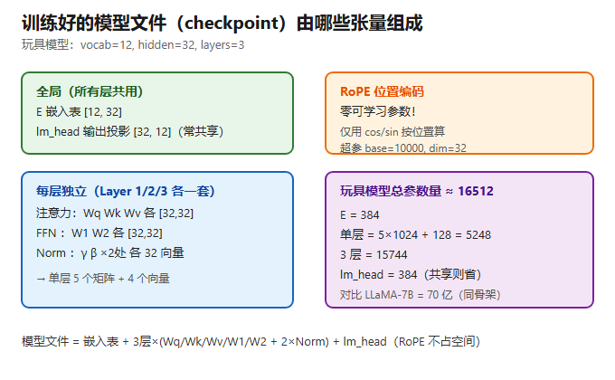

### 1.2 玩具模型总参数量估算

- 嵌入表 `E[12,32]` = **384**
- 单层：5 个 `32×32` 矩阵 = 5×1024 = 5120；2 处 Norm 各 `γ+β` = 64×2 = 128 → 小计 **5248**
- 3 层 = 5248 × 3 = **15744**
- `lm_head[32,12]` = **384**（若与 `E` 共享则省去）
- **总计 ≈ 16512**（共享权重则 ≈ 16128）

> 对照：你的玩具约 **1.6 万**参数；LLaMA-7B 是 **70 亿**——差约 4 万倍，但**结构骨架一模一样**，只是 hidden 从 32 换成 4096、层数从 3 换成 32、vocab 从 12 换成 32000。

### 1.3 模型文件 vs 真实 LLaMA 的小差异（了解即可）
- 真实 LLaMA 用 **RMSNorm**（只有 `γ`、没有 `β`），且线性层通常 `bias=False`，偏移职责交给 Norm 的 `γ/β`。
- 真实 LLM 的 FFN 是**膨胀**的：`[4096, 11008] → [11008, 4096]`，中间约 2.7 倍；你的玩具保持 32→32→32 不膨胀，逻辑完全正确，只是「脑容量」小。

---

## 2. 每层推理所需的矩阵参数

### 2.1 单个 Transformer Block 的参数清单

每层 = 两个并列子层（注意力 + FFN），各自带独立权重：

| 子层 | 参数 | 形状 | 数量 |
|---|---|---|---|
| 注意力投影 | `Wq`, `Wk`, `Wv` | `[32,32]` | 3 个 |
| 注意力 Norm | `γ_attn`, `β_attn` | `32` | 2 个向量 |
| FFN | `W1`, `W2` | `[32,32]` | 2 个 |
| FFN Norm | `γ_ffn`, `β_ffn` | `32` | 2 个向量 |
| **单层小计** | | | **5 个 `[32,32]` 矩阵 + 4 个 `32` 向量** |

### 2.2 3 层模型的完整参数表

```
全局（1 份）:
  E        [12, 32]       ← 嵌入表
  lm_head  [32, 12]       ← 输出投影（可与 E 共享）

Layer 1（独立）:   Wq, Wk, Wv, W1, W2  (各 [32,32])  +  Norm×2 (各 γ,β)
Layer 2（独立）:   Wq, Wk, Wv, W1, W2  (各 [32,32])  +  Norm×2 (各 γ,β)
Layer 3（独立）:   Wq, Wk, Wv, W1, W2  (各 [32,32])  +  Norm×2 (各 γ,β)
```

> 所以注意力矩阵共有 `3 层 × 3 = 9` 个独立的 `[32,32]`（Wq/Wk/Wv 各 9 个）；FFN 矩阵共 `3×2 = 6` 个。

### 2.3 三个必须记牢的认知
1. **都是「可学习参数」，存于 checkpoint**：推理时直接加载，不再变化。
2. **权重跨 token 位置共享，但不跨层共享**：同一层里 5 个 token 共用同一份 `Wq`；不同层各有各的。
3. **实现上常合并**：框架常把 `Wq/Wk/Wv` 拼成 `[32, 96]` 一次算完再切分，但**数学等价于 3 个独立 `[32,32]`**，按 3 个理解最清楚。

---

## 3. 推理过程详细步骤（以 "1+2+3" 为例）

整体数据流（形状全程跟踪）：

```
"1+2+3"
  → 分词 → id [1,10,2,10,3]                              (N=5)
  → 嵌入查表 → x [5, 32]
  → 3× Transformer Block → 每层输出仍是 [5, 32]
  → 取最后位置 → [1, 32]
  → lm_head → [1, 12] → softmax → 采样 → 下一个 token
  → 自回归循环，直到生成 '='、'6'、结束符
```

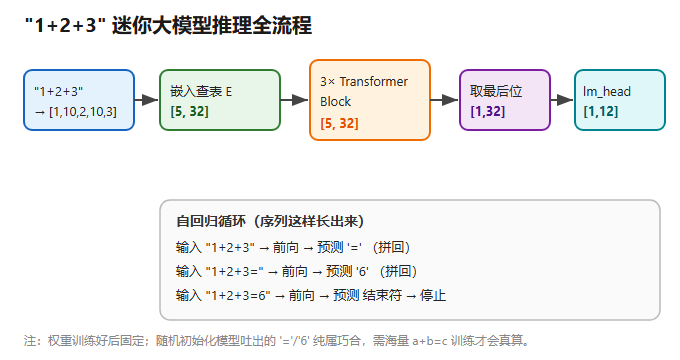

### 第 0 步：分词（Tokenization）

```
"1+2+3"  →  ["1", "+", "2", "+", "3"]
         →  id 序列 [1, 10, 2, 10, 3]        # vocab 顺序: 0..9 → id 0..9; '+' → 10; '=' → 11
```
这 5 个 id 就是后续所有矩阵运算的**索引**。

### 第 1 步：嵌入查表 → `[5, 32]`

模型文件里存着嵌入表 `E[12, 32]`（12 行 = 12 个 token，32 列 = 隐藏维）。这一步是 **gather（按 id 取行），不是矩阵乘**：

```
h[0] = E[1]    ∈ R^32    ← token "1"
h[1] = E[10]   ∈ R^32    ← token "+"
h[2] = E[2]    ∈ R^32    ← token "2"
h[3] = E[10]   ∈ R^32    ← token "+"（与 h[1] 同取第 10 行，初始向量相同）
h[4] = E[3]    ∈ R^32    ← token "3"
```
拼起来 = 残差流 `x`，形状 **`[5, 32]`**。此时 5 个 token 各自孤立，**彼此不知道对方存在**。

> 注意：`x` 本身是 `[5,32]`，**位置信息尚未进入**——它会在每层的注意力里由 RoPE 注入。

![分词 → 嵌入查表 → [N,32]](../images/diag_token_embed.png)

### 第 2 步：进入 3 层 Transformer Block

每层内部结构**完全一致**（只是换各自权重）。下面以 **Layer 1** 详细拆解。

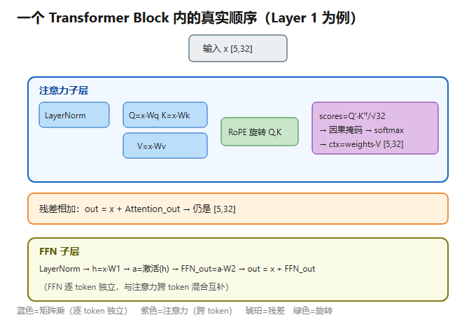

#### (a) LayerNorm（注意力子层之前）
对 `x` 逐位置归一化（减均值、除标准差，再 `γ` 缩放 + `β` 偏移），形状仍是 `[5, 32]`。此步**不是矩阵乘**，且无跨 token 交互。

#### (b) Q / K / V 投影（你设计的 `32×32` 矩阵乘在这里）
```
Q = x · Wq   → [5,32] × [32,32] = [5,32]     # Wq 跨 5 个位置共享
K = x · Wk   → [5,32]
V = x · Wv   → [5,32]
```
- **逐 token 独立并行**：token 0 的结果绝不流入 token 1。
- `Wq` 是 `[32,32]` 的含义：左 32 = `x` 的列数，右 32 = 输出维度；所以 `Q/K/V` 出来**还是 `[5,32]`**，才能做残差相加。
- 这里 `x` 是 `[5,32]` 矩阵（5 行 = 5 个 token，32 列 = 特征）。

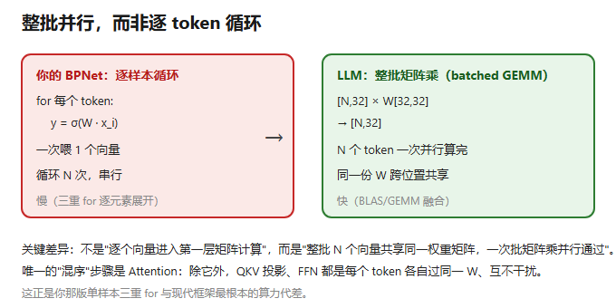

#### (c) RoPE 旋转 Q、K（按位置注入顺序）
把每个 token 的 32 维向量**按下标两两配对**成 16 对 `(0,1)(2,3)…(30,31)`，每对当成一个 2D 坐标绕原点旋转：

1. **预计算频率角**（只算一次，与位置无关）：`θ_i = base^(−2i/32) = 10000^(−i/16)`，`i = 0..15`：

   | i | θ_i | i | θ_i |
   |---|---|---|---|
   | 0 | 1.000000 | 8 | 0.010000 |
   | 1 | 0.562341 | 9 | 0.005623 |
   | 2 | 0.316228 | 10 | 0.003162 |
   | 3 | 0.177828 | 11 | 0.001778 |
   | 4 | 0.100000 | 12 | 0.001000 |
   | 5 | 0.056234 | 13 | 0.000562 |
   | 6 | 0.031623 | 14 | 0.000316 |
   | 7 | 0.017783 | 15 | 0.000178 |

   这是一条等比数列，公比 `10000^(−1/16) ≈ 0.562341`。低序号对转得快（高频，捕捉局部），高序号对转得慢（低频，捕捉全局）。

2. **每个位置 m 的旋转角**：`φ_{m,i} = m · θ_i`（m = 0..4）。`m=0` 全 0（不转）；`m=4` 转得最多。

3. **逐对旋转**（以位置 m 的第 i 对 `(q_{2i}, q_{2i+1})` 为例）：
   ```
   q'_{2i}   = q_{2i}·cos φ − q_{2i+1}·sin φ
   q'_{2i+1} = q_{2i}·sin φ + q_{2i+1}·cos φ
   ```
   16 对做完 → 旋转后的 `q'`（仍 32 维）。对 `m=0..4` 全做一遍 → **Q'[5,32]**。

- **K 同理**（同位置、同 θ，用相同旋转）→ **K'[5,32]**。
- **V 不旋转**，保持原 `V[5,32]`。
- **只作用于 Q、K，不作用于 V 和残差流 x**；且**每层都重新旋一次**（因为每层的 Q/K 是新向量）。
- **总旋转次数 = 32（层）× 5（token）**，但对象永远是 Q、K。

> 关键性质：旋转是正交矩阵 `R(m)`，有 `R(m)ᵀ·R(n) = R(n−m)`，于是 `Q'[m]·K'[n] = Q·R(n−m)·K`——**点积只含相对距离 `n−m`**，位置信息干净地渗进注意力。

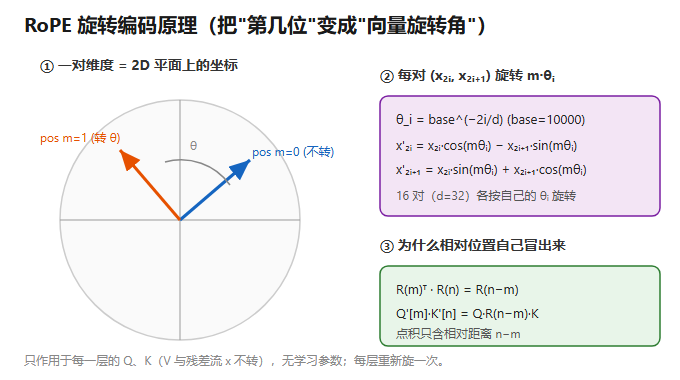

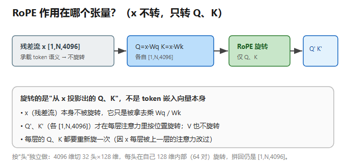

#### (d) Attention —— 全场唯一「跨 token 混合」的地方

**① 分数矩阵 `scores = Q' · K'ᵀ / √32 → [5,5]`**
```
维度: Q'[5,32] × K'ᵀ[32,5] = [5,5]   （中间维 32 对齐相消）
元素: scores[i][j] = ( Σ_{k=0}^{31} Q'[i][k]·K'[j][k] ) / √32
```
- `i` = Query 位置（谁在问），`j` = Key 位置（问谁），`k` = 特征维度（0..31 逐对相乘再求和 = 点积）。
- **为什么 ÷√32**：32 维点积方差随 √d 增长，除以 `√d≈5.657` 把数值拉回 ~1，防止 softmax 极端化、梯度消失。这就是标准的 **scaled dot-product attention**。

![Q'·K'ᵀ → scores [5,5]](../images/diag_scores.png)

**② 因果掩码（causal mask）**
语言模型从左到右生成，第 i 个 token 不能看未来：当 `j > i` 时 `scores[i][j] = −∞`，softmax 后权重 = 0。
- `pos0('1')` 只看自己 → 第 0 行仅 `(0,0)` 有效；
- `pos4('3')` 看 `0..4` 全部 → 第 4 行全有效，**汇聚所有前文**（呼应你最早问的「前面影响第 N-1 个」）。

**③ softmax 按行归一 → `weights[5,5]`**
```
weights[i][j] = exp(scores[i][j]) / Σ_{k≤i} exp(scores[i][k])
```
每行和为 1，`weights[i][j]` = 第 i 个 token 对第 j 个 token 的关注概率。

示例（示意）`pos4` 那行：
```
scores[4]  ≈ [-0.2, 0.5, 1.8, 0.3, 2.5]
weights[4] ≈ [0.04, 0.08, 0.32, 0.06, 0.50]   ← 最关注自己(0.50)和 '2'(0.32)
```

**④ 聚合内容 `ctx = weights · V → [5,32]`**
```
ctx[i] = Σ_{j=0}^{i} weights[i][j] · V[j]      ← 第 i 行 = 按权重聚合前面所有 V
```
`V[0..4]` 各 32 维，加权求和后 `ctx[4]` 仍是 32 维，但已「揉进 1+2+ 的全部信息」。

> `[5,5]` 分数矩阵本身**不进下一层**——它只是「路由表」，决定每个 token 该从别处抄多少内容；真正流下去的是 `ctx`。

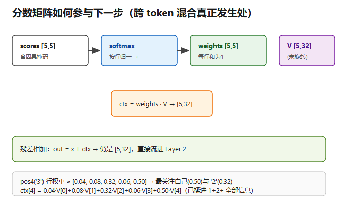

#### (e) 残差相加 → `out[5,32]`
```
out = x + ctx        ← x 是进入本层时的残差流
```
形状仍是 `[5,32]`（残差流等宽）。

#### (f) FFN 子层（逐 token 独立深加工）
```
① LayerNorm（独立一套 γ,β）
② h = x · W1   → [5,32]      # 逐 token 独立矩阵乘
③ a = 激活(h)   → [5,32]      # 现代用 GELU/SiLU（非线性，关键！）
④ FFN_out = a · W2 → [5,32]   # 逐 token 独立矩阵乘
⑤ out = x + FFN_out → [5,32]  # 残差相加
```
- **FFN 是逐 token 独立的**：每个 token 各过一遍，token 之间不交互——和注意力子层（跨 token）正好互补。
- **那步激活引入的非线性**正是模型能拟合复杂模式的来源（没有它，多层退化为一层）。
- 真实 LLM 的 FFN 是膨胀的 `4096→11008→4096`；你的玩具 32→32→32 不膨胀，逻辑正确。

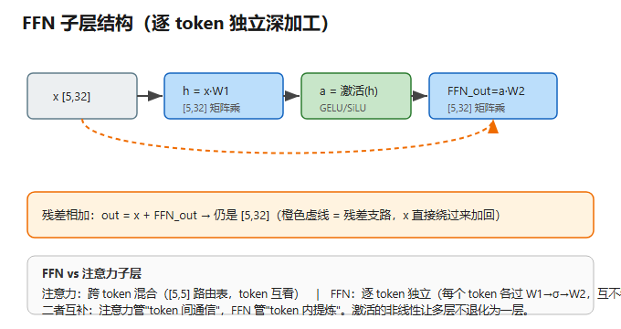

#### 重复 3 层
Layer 1 输出 `[5,32]` → 流进 Layer 2（同结构、独立权重）→ Layer 3。三层下来，每个位置的向量都被「向前看」3 次，`pos4` 的向量已凝聚 `1+2+` 的全部上下文。

### 第 3 步：输出层 → 预测下一个 token

- **只取最后位置**（推理时）：`h_last = x[4] → [1, 32]`。
  > 训练时是所有位置同时预测各自的下一个；推理时退化成「每次只产出一个 token」。
- **lm_head 投影**：`[1,32] × W_out[32,12]ᵀ → [1, 12]`（logits）。`W_out` 常 = 嵌入表 `E` 的转置（权重绑定）。
- **softmax → 概率分布** `[1, 12]`。
- **采样** → 一个 token id。贪心取最大 / 温度采样 / top-p。

对 "1+2+3"，模型预测下一个是 **'='**（id 11）。

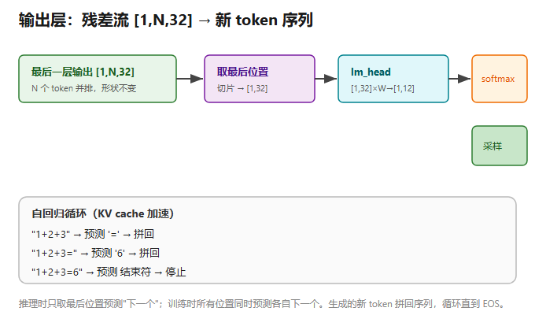

### 第 4 步：自回归循环（序列怎么长出来）

```
输入 "1+2+3"        → 前向 → 预测 '='       （拼回）
输入 "1+2+3="       → 前向 → 预测 '6'       （拼回）
输入 "1+2+3=6"      → 前向 → 预测 结束符     → 停止
```
模型不是一步算出 `6`，而是一个字一个字吐。生成新 token 时：
- **KV cache**：第一次全量前向已缓存每个位置的 K、V，之后每生成一个新 token 只算它自己的位置，从缓存取前面的 → 越生成越省。
- 张量阶数在输出层降下来：`[1,N,32]` → 切片 `[1,32]` → lm_head `[1,12]` → 采样坍缩成**一个标量 id** → 重新拼回 `[1,N+1,32]`（闭环）。

> ⚠️ **重要前提**：上面走的是「计算图 / 数据怎么流动」，不是「模型真会算 1+2+3=6」。权重 `E/Wq/Wk/Wv/FFN/lm_head` 都是**训练出来的**；随机初始化的模型吐出的 '=' 和 '6' 纯属巧合。要让它真会算，得用海量 `a+b=c` 式子训练。但**这套结构（嵌入查表 + 3 层 32×32 + 注意力 + lm_head）和真实小模型的推理骨架完全一致**。

---

## 4. 关键认知一页速查

| 主题 | 结论 |
|---|---|
| 模型 = 一个 Tensor？ | ❌ 是**计算图**，图里有成百上千个张量（权重 + 激活）|
| 每层 = 一个矩阵？ | ⚠️ 层的**权重**通常是 2 阶矩阵；层本身 = 计算 + 参数张量 |
| 每层的节点数一致吗？ | 层间**接口宽度恒定**（残差流锁死），层内峰值宽度临时膨胀再收回 |
| 向量×矩阵对吗？ | ✅ 线性层核心就是 `W·x + b`；大模型按整条序列做**批量 GEMM** |
| 阶数由谁决定？ | 由**数据形状**决定：权重多 2 阶（LLM 的 `W[hidden,hidden]`），激活因 batch/seq 升 3 阶 `[N,seq,hidden]`，卷积核/注意力分 4 阶 |
| RoPE 作用在？ | 每层的 **Q、K**（不是 V、不是 x）；逐对旋转，无学习参数；每层重旋 |
| 跨 token 影响在哪？ | 只在 **Attention**（不是矩阵乘）；矩阵乘逐 token 独立并行 |
| 注意力公式 | `scores = Q'·K'ᵀ / √d → 因果掩码 → softmax → weights → ctx = weights·V` |
| FFN 特点 | 逐 token 独立、非线性激活、与注意力互补 |
| 输出 | 取最后位置 `[1,hidden]` → lm_head → softmax → 采样 → 自回归 |

---

## 5. 玩具模型 vs 真实 LLM（LLaMA-7B）对照

| 维度 | 你的玩具 | LLaMA-7B |
|---|---|---|
| vocab | 12 | 32000（LLaMA-3 为 128000）|
| hidden | 32 | 4096 |
| 层数 | 3 | 32 |
| 每层矩阵 | 5 个 `[32,32]` | 5 类 `[4096,4096]`（QKV + 2×FFN），FFN 中间 11008 |
| 注意力头 | 不分头（直接 16 对旋转）| 32 头，每头 128 维，RoPE 在头内旋转 |
| 激活 | GELU/SiLU | SiLU（SwiGLU FFN）|
| 参数量 | ≈ 1.6 万 | 70 亿 |
| 结构骨架 | 完全一致 | 完全一致 |

> **一句话总结**：你今天建立的「分词 → 嵌入查表 `[N,hidden]` → 每层（LayerNorm → QKV 投影 → RoPE → Attention → 残差 → FFN → 残差）→ 取最后位置 → lm_head → softmax → 采样 → 自回归」心智模型，已经抓住了现代大模型 90% 的推理机制。剩下 10% 是训练如何得到这些权重、以及 MoE / 长上下文等工程增强。

---

*附：本文所有矩阵维度均按玩具模型 `vocab=12, hidden=32, layers=3` 推演；若要改为 31 维，把所有 32 换成 31、√32 换成 √31 即可，逻辑不变。*

---

## 6. 补充示意图（概念速览）

### 单层计算本质 = 矩阵乘法
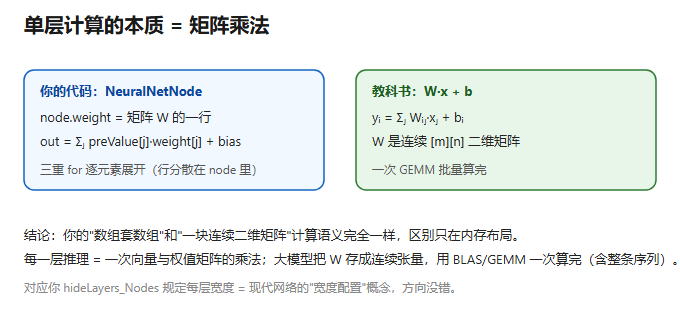

### Transformer 块的计算构成
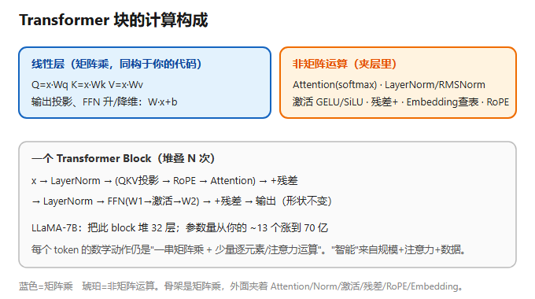

### 张量阶数在现代网络中的真实用途
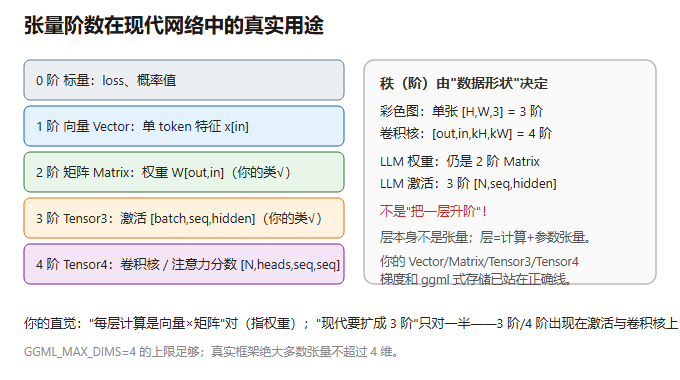

### 大模型每层节点数是否一致
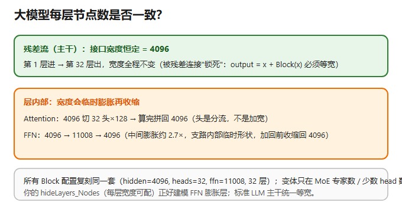

### vocab_size 的物理意义
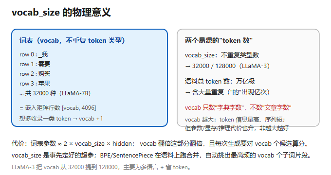

### "层"指模型层，不是 token 向量
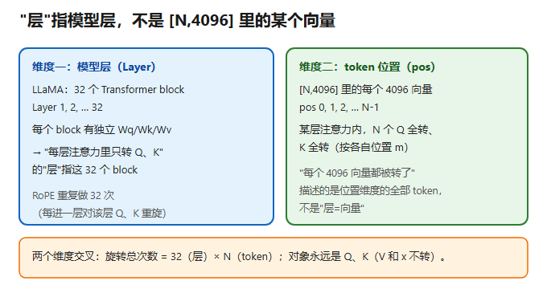

---

## 7. 全推理过程平面示意图（总览）

下图用 **平面张量块**完整描绘一次前向推理的全部数据流（玩具模型 `1+2+3`，`vocab=12 / hidden=32 / 3 层`）：

- **彩色块** = 数据张量（激活值），**灰色块** = 权重矩阵 `W`，**橙色块** = 输入/输出 token；块内网格线表示张量的矩阵维度；
- 主干自上而下：分词 → 嵌入查表 → 3 层 Block（每层含注意力子层 + FFN 子层）→ 取最后位置 → lm_head → softmax → 采样 → 自回归回环。

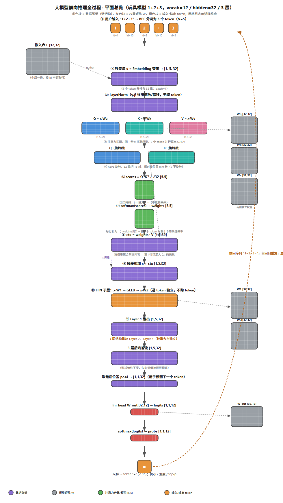

> 
